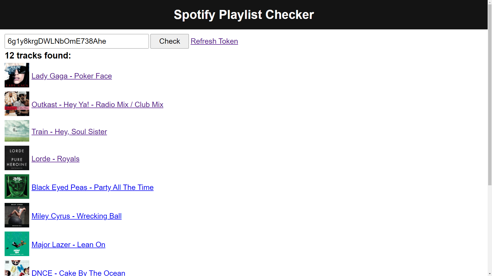

# Spotify Playlist Checker

This app allows you to scan a playlist and find tracks on unavailable albums.

## How to use it?

1. Visit this website: [pawllo01.github.io/spotify-playlist-checker](https://pawllo01.github.io/spotify-playlist-checker/).
2. Click on "_Get Token_" link and then click agree.
3. Paste valid Spotify playlist ID in the text field, e.g.: **6g1y8krgDWLNbOmE738Ahe**.
4. Click on "_Check_" button.
5. If tracks on unavailable albums are found, they will be listed below.

## How to fix tracks on unavailable albums?

First, delete the track from your playlist / liked songs and then re-add it.

I also recommend using [Spotify Album Availability](https://github.com/kaaes/albums-availability) to visualise where the album is available
and to find possible alternatives. Just click on the album cover next to the track name.

## FAQ

### What does it mean track is on unavailable album?

It means artist or label deleted this album from Spotify, however in 99% of cases they re-released it again.

### Why artists/labels re-release albums?

Basically, to fix metadata like track names, release date, etc.
It's not easy to make changes to an already released album. Artists or labels first need to remove the album and then re-add it with fixed metadata.
